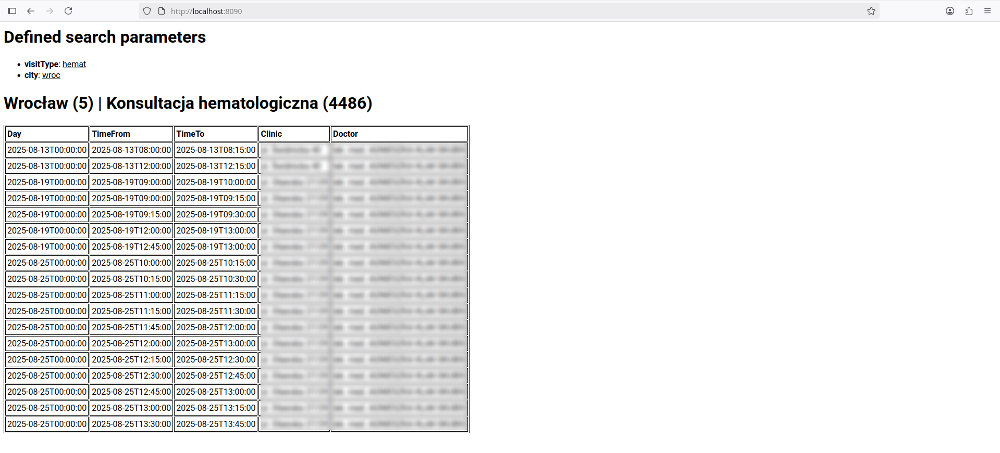

# LuxmedCheck

## About

This is a PoC for a project, which end-goal is to:
* Learn Go (particularly: dealing with API responses, writing unit tests, trying to wrap my head around the "half-objective" nature of this language)
* Create a working console tool to get Luxmed visit openings (official UI is problematic, does not refresh well, constantly requires you to answer additional questions); also in the future, there should be more filters, better stability, continuos/looped requests + notification whenever new opening appears

**Again, for the time being, this is PoC/WIP and topic is still being researched**: it doesn't have all the filters and other features yet, plus crashes like crazy in some cases, for reasons yet unknown; most likely explanation is me not correctly interpreting API responses, which is understandable, as I don't exactly have documentation for it ;) 

## Quickstart

1. Download/clone this repo
2. Install Go/Golang: https://go.dev/doc/install
3. Open bash/ps1/cmd and go to root directory
4. Type `go run . -city="wroc" -visitType="hemat"`
5. Type your Luxmed login, press `enter`, then type your Luxmed password, also press `enter` (note: not seeing any characters is intentional way of masking login/password)

Typical output should look like this:
```
==============================
SzymonZet/LuxmedCheck
==============================

 PARAMETER : VALUE               
 visitType | hemat               
      city | wroc                

Type Luxmed Login and press enter: 
Type Luxmed Password and press enter: 

==============================

2025/08/12 23:25:55 main processing started...
2025/08/12 23:25:56 logged in successfully
2025/08/12 23:25:56 at least one variant / visit type found successfully
2025/08/12 23:25:56 at least one city found successfully
2025/08/12 23:25:57 list of terms/visits obtained successfully
2025/08/12 23:25:57 main processing completed successfully
2025/08/12 23:25:57 server started on: 127.0.0.1:8090
```
(as mentioned, some additional errors may appear, depending on the specific input; again, it is pretty much WIP)

As the log suggests, you should see the results on `http://127.0.0.1:8090/` (accessible via browser):
